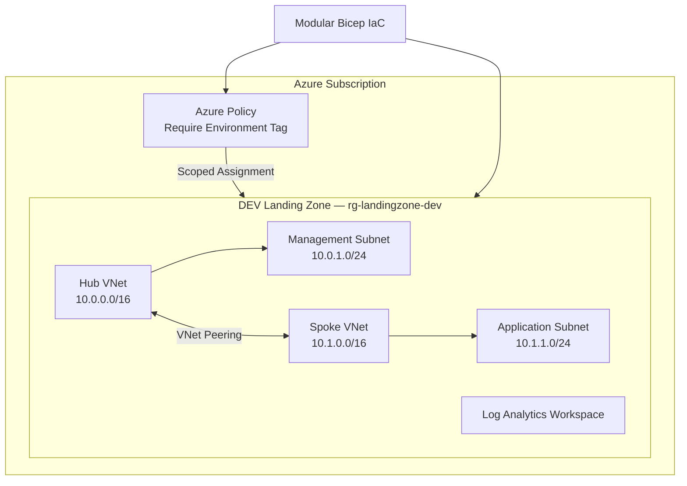
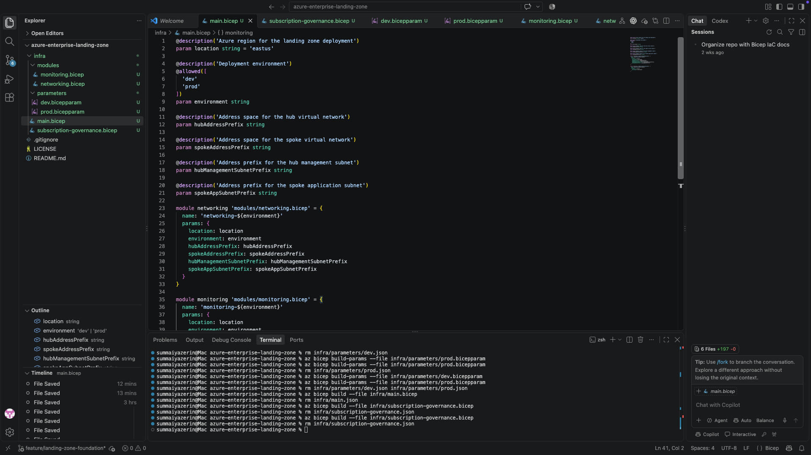
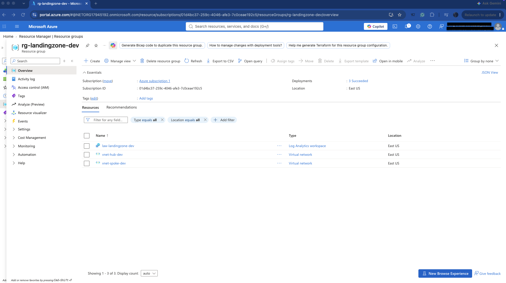
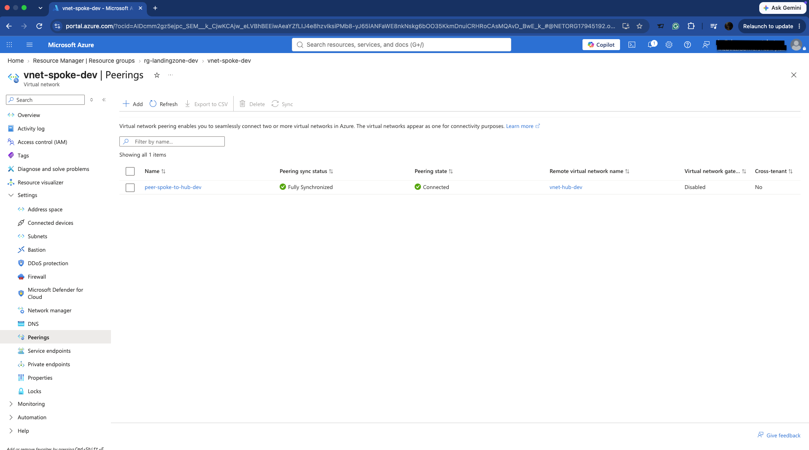
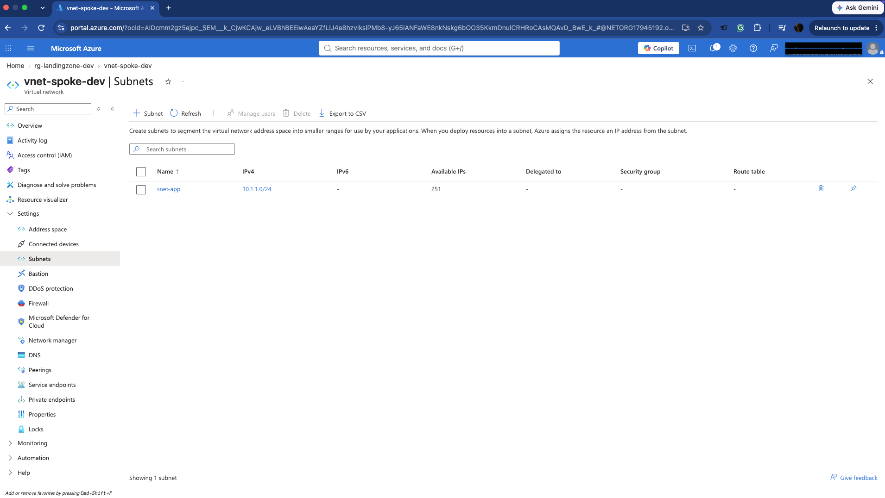
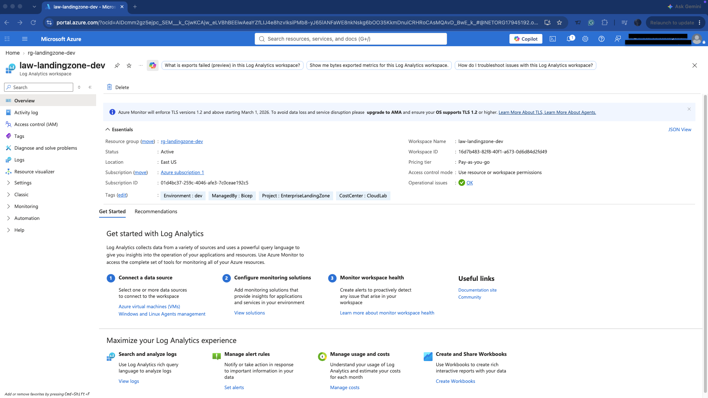
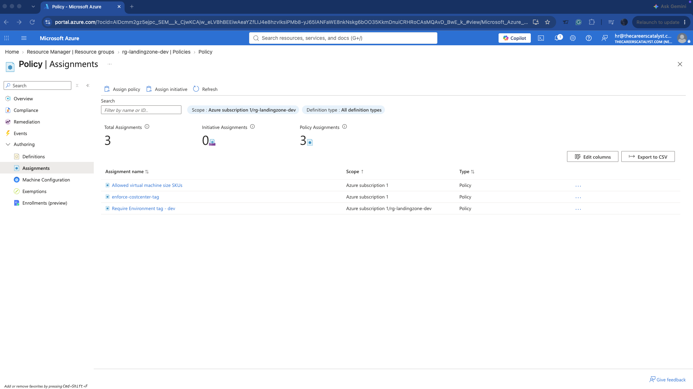
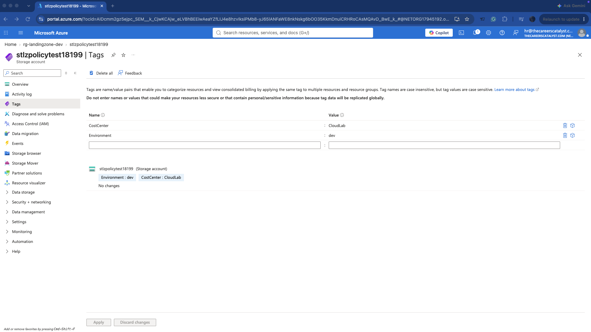

# Enterprise Azure Landing Zone

A modular Azure landing zone implemented with Bicep to demonstrate reusable infrastructure, environment separation, hub-and-spoke networking, policy-based governance, and centralized monitoring.

The DEV environment was deployed and validated in Azure. The PROD configuration uses the same reusable modules with separate network parameters and was validated without deployment.

## Architecture



## Architecture Components

| Component | Implementation |
|---|---|
| Infrastructure as Code | Modular Bicep templates |
| Network topology | Hub-and-spoke |
| Hub VNet | `vnet-hub-dev` — `10.0.0.0/16` |
| Management subnet | `snet-management` — `10.0.1.0/24` |
| Spoke VNet | `vnet-spoke-dev` — `10.1.0.0/16` |
| Application subnet | `snet-app` — `10.1.1.0/24` |
| Connectivity | Bidirectional VNet peering |
| Governance | Custom Azure Policy requiring `Environment` tag |
| Policy scope | Landing-zone resource group |
| Monitoring | Log Analytics workspace |
| Resource metadata | Environment, CostCenter, ManagedBy, Project tags |

## Environment Strategy

The same Bicep modules are reused across environments through separate parameter files.

| Environment | Hub Network | Spoke Network | Status |
|---|---|---|---|
| DEV | `10.0.0.0/16` | `10.1.0.0/16` | Deployed |
| PROD | `10.10.0.0/16` | `10.11.0.0/16` | Azure validation completed |

This approach separates environment configuration from infrastructure implementation and avoids duplicating deployment logic.

## Repository Structure

```text
.
├── diagrams/
│   └── architecture.md
├── docs/
│   ├── 001-hub-spoke-networking.md
│   └── 002-policy-scope.md
├── infra/
│   ├── modules/
│   │   ├── monitoring.bicep
│   │   └── networking.bicep
│   ├── parameters/
│   │   ├── dev.bicepparam
│   │   └── prod.bicepparam
│   ├── main.bicep
│   ├── resource-group-governance.bicep
│   └── subscription-governance.bicep
└── screenshots/
```

## Governance

Governance is implemented as code using Azure Policy.

The custom policy definition requires supported resources to contain an `Environment` tag. The policy definition is created at subscription scope while its assignment is limited to the landing-zone resource group.

This design provides centralized policy definition while preventing the project-specific deny policy from affecting unrelated workloads in the subscription.

Policy enforcement was validated by attempting two deployments:

1. A resource without the required `Environment` tag was denied.
2. A resource containing `Environment=dev` and the existing required `CostCenter` tag deployed successfully.

The temporary validation resource was removed after testing.

## Deployment Validation

Infrastructure changes were evaluated with Azure What-If before deployment.

During the initial DEV deployment, Azure exposed a provisioning dependency between subnet updates and VNet peering creation. Explicit Bicep dependencies were added so subnet provisioning completes before peering operations begin.

The updated template passed Azure validation and the subsequent deployment completed successfully.

The PROD parameter set was also validated against Azure without deploying a second environment.

## Deployment Evidence

### Modular Bicep Infrastructure


### DEV Landing Zone Resources



### VNet Peering



### Application Subnet



### Centralized Monitoring



### Azure Policy Assignment



### Policy-Compliant Resource



## Deployment

Validate the DEV deployment:

```bash
az deployment group validate \
  --resource-group <resource-group> \
  --template-file infra/main.bicep \
  --parameters infra/parameters/dev.bicepparam
```

Preview infrastructure changes:

```bash
az deployment group what-if \
  --resource-group <resource-group> \
  --template-file infra/main.bicep \
  --parameters infra/parameters/dev.bicepparam
```

Deploy the landing-zone foundation:

```bash
az deployment group create \
  --resource-group <resource-group> \
  --template-file infra/main.bicep \
  --parameters infra/parameters/dev.bicepparam
```

## Architecture Decisions

Detailed design decisions are documented in:

- [`ADR 001 — Hub-and-Spoke Network Architecture`](docs/001-hub-spoke-networking.md)
- [`ADR 002 — Scoped Azure Policy Enforcement`](docs/002-policy-scope.md)

## Technologies

Azure · Bicep · Azure Virtual Network · VNet Peering · Azure Policy · Log Analytics · Azure CLI · Git · GitHub
