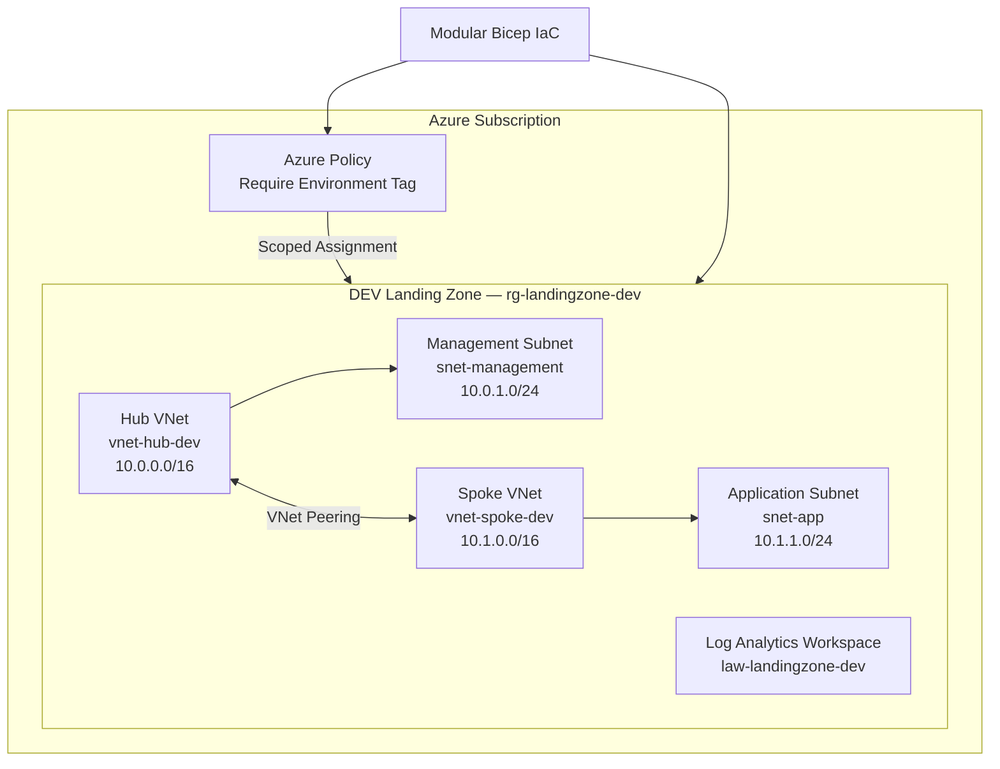

# Enterprise Azure Landing Zone Architecture

## Environment Strategy

| Environment | Hub VNet | Spoke VNet | Deployment |
|---|---|---|---|
| DEV | 10.0.0.0/16 | 10.1.0.0/16 | Deployed |
| PROD | 10.10.0.0/16 | 10.11.0.0/16 | Validated only |

Production uses the same modular Bicep templates with environment-specific parameters, allowing infrastructure reuse without duplicating deployment logic.

